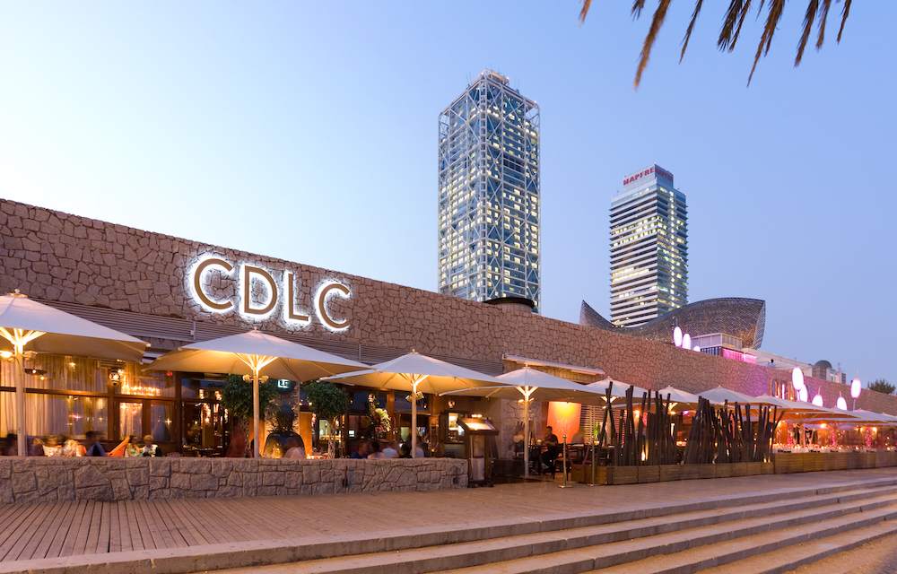
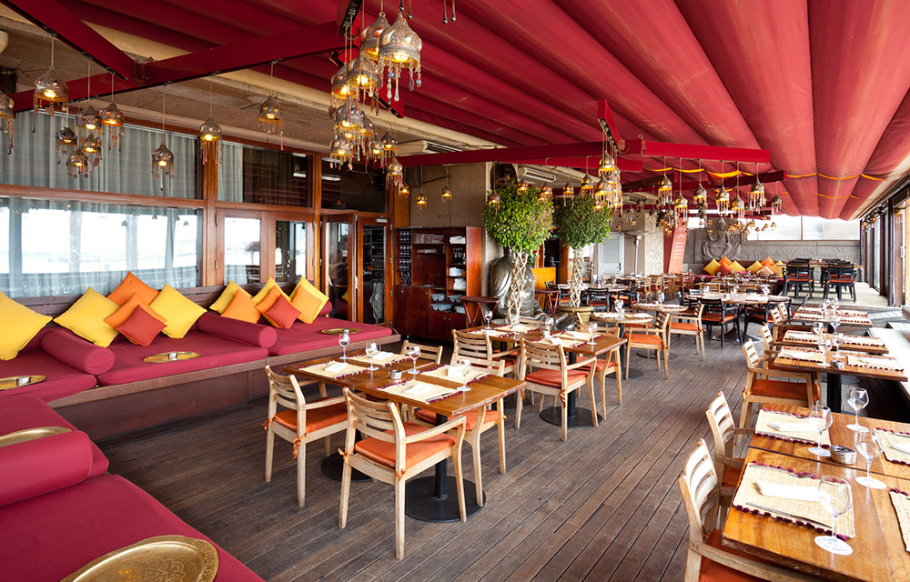
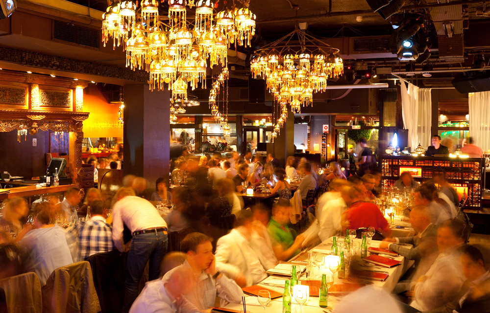
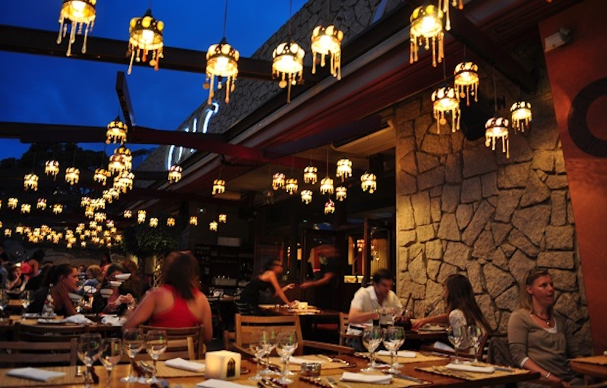

<head>
<link rel="stylesheet" href="https://cdnjs.cloudflare.com/ajax/libs/font-awesome/4.7.0/css/font-awesome.min.css">
</head>

  <h3>CDLC Restaurant and Beach Club</h3>
  
Next to Hotel Arts and just in front of the beach we find the **Carpe Diem Lounge Club**, also known as CDLC.

This club has become, over the years, a meeting point where night after night people from here and there come looking for a cool atmosphere. With no trace of doubt, this is one of the most fashionable spots in the city and, if we want to see and be seen, this is definitely the right place to go.

Open at noon, the kitchen works with no interruption until after midnight. The menu includes suggestions that will please those who love fusion cooking. Sushis, makis and exotic salads, along with more common flavours get mixed on **CDLC's tables**.

However, the indisputable strong point of the restaurant-club is the decor and atmosphere, that will take our minds to other regions of the world from the very same moment we step in. The teak wood colonial furniture and the red and orange curtains remind us of the far-away magnificient Oriental palaces.

  

    
  

  

  
  

  

  
  

  

  

 

  

  
  

  

  
  

  

  

 

<section class="container">

<i class="fa fa-map-o" style="font-size:20px;color:orange;"></i> 
<b>Location:</b> Barceloneta Beach
 

<i class="fa fa-cutlery" style="font-size:20px;color:orange;"></i> 
<b>Dining room capacities:</b> 350 seated / 700 pax cocktail
 

<i class="fa fa-eur" style="font-size:20px;color:orange;"></i> 
<b>Price Level:</b> average-high
 

<i class="fa fa-apple" style="font-size:20px;color:orange;"></i> 
<b>Vegetarian Options/Special diets:</b> Available
 

<i class="fa fa-handshake-o" style="font-size:20px;color:orange;"></i> 
<b>Style:</b> Fusion cuisine

<i class="fa fa-wheelchair" style="font-size:20px;color:orange;"></i> 
<b>Handicapped access:</b> Yes
 

</section>

  

