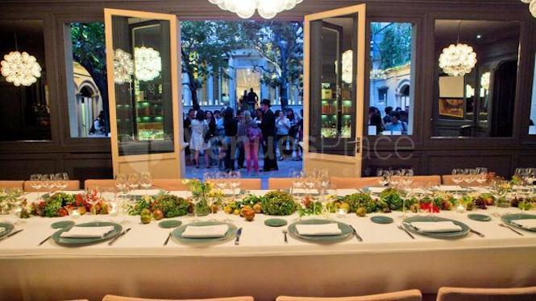
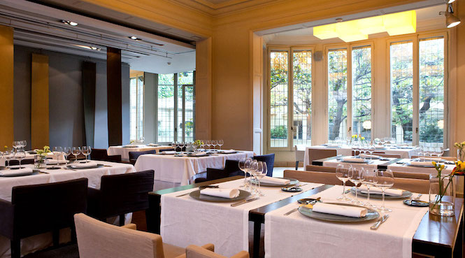
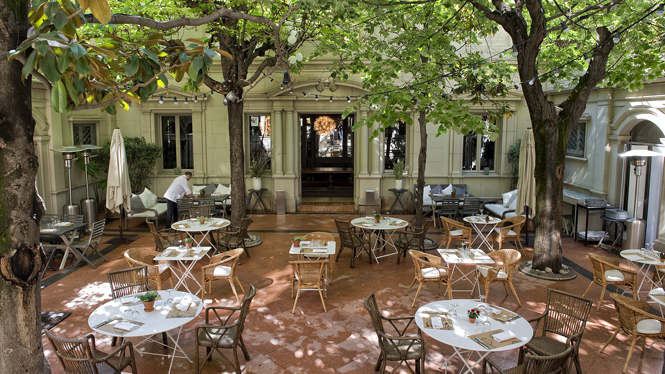

<head>
<link rel="stylesheet" href="https://cdnjs.cloudflare.com/ajax/libs/font-awesome/4.7.0/css/font-awesome.min.css">
</head>

  <h3>Restaurant El Principal</h3>
  
 Located 50 meters from the famous La Pedrera and Paseo de Gracia, **El Principal** is a versatile space.It is a stately main floor flooded with natural light thanks to its large windows. It has a magnificent interior courtyard is dividing the space in 2 but with good weather the whole venue has a capacity for 500 pax in cocktail style.
  **El Principal** bases its cuisine in the traditional Catalan cuisine and seasonal products, and offer proposals developed especially for groups and special occasions. Also it has an extensive wine list.
  On the basement it has a small private disco-club up to 150 pax, that can be used after dinner to extend the party.

  

   
  

  

  
  

  

  
  

  

  
  

  

  

<section class="container">

<i class="fa fa-map-o" style="font-size:20px;color:orange;"></i> 
<b>Location:</b> City centre
 

<i class="fa fa-cutlery" style="font-size:20px;color:orange;"></i> 
<b>Dining room capacities:</b> 500pax cocktail / seated 264 pax
 

<i class="fa fa-eur" style="font-size:20px;color:orange;"></i> 
<b>Price Level:</b> average-high
 

<i class="fa fa-apple" style="font-size:20px;color:orange;"></i> 
<b>Vegetarian Options/Special diets:</b> Available
 

<i class="fa fa-handshake-o" style="font-size:20px;color:orange;"></i> 
<b>Style:</b>  Mix of Mediterranean and author cuisine

<i class="fa fa-wheelchair" style="font-size:20px;color:orange;"></i> 
<b>Handicapped access:</b> Yes
 

</section>

  

