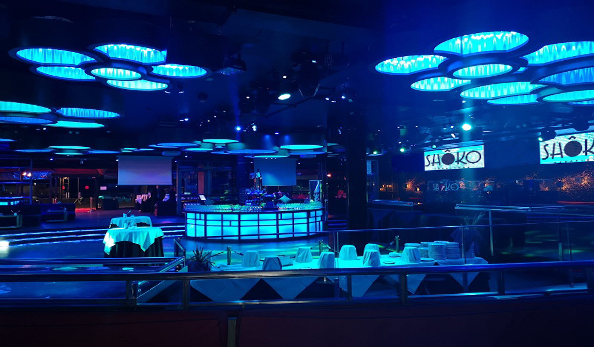
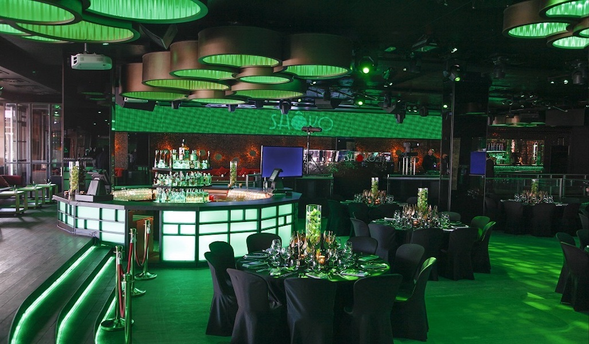
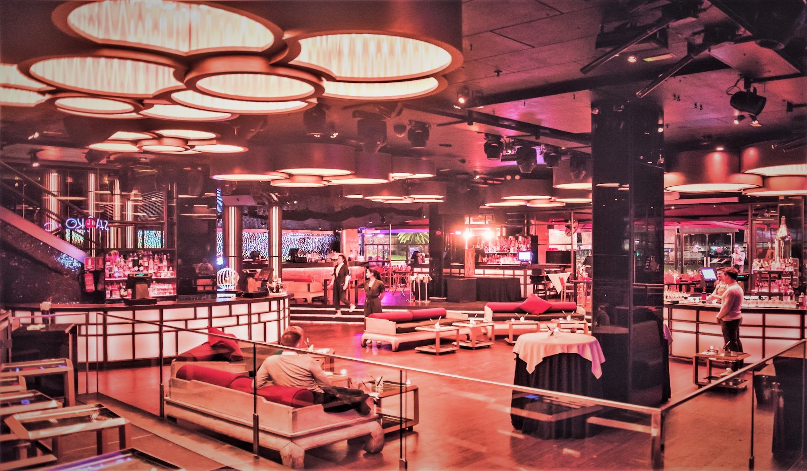

<head>
<link rel="stylesheet" href="https://cdnjs.cloudflare.com/ajax/libs/font-awesome/4.7.0/css/font-awesome.min.css">
</head>

  <h3>Shoko Restaurant and Beach Club</h3>
  
Located in the beach front, right next to Hotel Arts, Shoko is a restaurant and lounge club with minimalist decor that takes us to a modern East in a unique space, designed according to Feng-Shui.

The restaurant’s cuisine is based on the fusion of cultures and flavours, being the Japanese gastronomy the most relevant in the menu, that features a large variety of dishes with good presentation.

Shoko is divided into different areas, including a lounge with elegant red sofas. Besides, we can enjoy the terrace by the beach all year long.
**TheShokoExperience** is a singular space, where you can enjoy from the breakfast to lunch, dinner, cocktails, dance in the disco and even have a VIP area next to the DJ booth.

  

    
  

  

  
  

  

  
  

  

  

 

  

  
  

  

  
  

  

  

 

<section class="container">

<i class="fa fa-map-o" style="font-size:20px;color:orange;"></i> 
<b>Location:</b> Barceloneta Beach
 

<i class="fa fa-cutlery" style="font-size:20px;color:orange;"></i> 
<b>Dining room capacities:</b> 458 seated / 875 pax cocktail
 

<i class="fa fa-eur" style="font-size:20px;color:orange;"></i> 
<b>Price Level:</b> average-high
 

<i class="fa fa-apple" style="font-size:20px;color:orange;"></i> 
<b>Vegetarian Options/Special diets:</b> Available
 

<i class="fa fa-handshake-o" style="font-size:20px;color:orange;"></i> 
<b>Style:</b> Fusion cuisine

<i class="fa fa-wheelchair" style="font-size:20px;color:orange;"></i> 
<b>Handicapped access:</b> Yes
 

</section>

  

